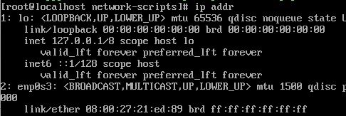

## 1. ip addr
Use this command to get the network you are using. For me, it is "ifcfg-enp0s3".

## 2. Then cd to "/etc/sysconfig/network-scripts" and find the file whose name is "ifcfg-enp0s3". Just edit it.
`
IPADDR=192.168.1.79
GATEWAY=192.168.1.1
NETMASK=255.255.255.0
DNS1=117.50.101.10
DNS2=52.80.52.52
`
Please remember to set ONBOOT to yes and BOOTPROTO to static (not dhcp)

## 3. service network restart